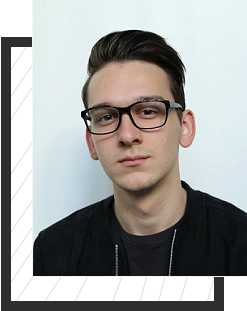

<!doctype html>
<html>
<head>

<meta charset="utf-8">
<title>★ Resume ★ Anes Paraganlija </title>
<link href='https://fonts.googleapis.com/css?family=Poppins' rel='stylesheet'>
<link rel="stylesheet" type="text/css" href="style.css"/>
<!--FONTAWESOME HAS BEEN USED FOR THIS WEBSITE-->

</head>
<body>
<section>
<!-- NAVIGATION -->
<nav>
<!--cs412-->
<a href="https://ecampus.ius.edu.ba/syllabus/cs412-web-application-development" target="_blank" class="cs412">CS412 Web Application Development</a>
<!--menu-->
<ul>
<li><a href="#about" class="active">About Me</a></li>
<li><a href="#education" class="active">Education & Skills</a></li>
<li><a href="#work" class="active">Work Experience</a></li>
<li><a href="#contact" class="active">Contact Me</a></li>
</ul>
</nav>
<!--text-->

<!--text-->

Hello,

MY NAME IS ANES PARAGANLIJA.

I am a Software Engineering student   and this is my resume!

<a href="https://github.com/Anesp/CS412---Finished-Resume" target="_blank"><button class="github-site">Website on GitHub</button></a>
<a href="https://workupload.com/start/U4df2aWqhug" target="_blank"><button class="down-cv">Download Resume</button></a>

<!--anes-->

</section>
<!--about-->

    <!--img-->
    
    <!--about-text-->
    

        
About Me

        
Student & Technical Supporter

        
Hello, My name is Anes Paraganlija. I was born on the 28th of August 1999 in the capital of Bosnia & Herzegovina - Sarajevo, where I currently reside as well.
            I am a Software Engineering student on the International University of Sarajevo. 
            At the moment, I am on my fifth semester. Besides that, I am working as a technical supporter in lenovo, for Germany, Austria, Switzerland, United Kingdom, Ireland.

        
This is my personal resume website, created by me as a part of the project for the course Web Development on my university.

        
    

<!--education-->

    <!--text-->
    

    
Education

    
AND QUALIFICATIONS

    
Below You can find some of the most relevant informations in regards to my qualifications and skills as well as my knowledge in various languages. Additionally, You can visit the websites of my educational institutions!

<!--box-->

<!--1-->

    1
    
Education

    
● 2014 - 2018 High School: <a href="http://treca-gimnazija.edu.ba/" target="_blank">Third Gymnasium Sarajevo</a>

    
● 2018 - 2022 University: <a href="https://www.ius.edu.ba/" target="_blank">International University of Sarajevo</a>

    
● Microsoft HTML & CSS Course

<!--2-->

    2
    
Programming Languages

    
<label for="c++">C and C++:</label>
        <progress id="c++" value="55" max="100"></progress>

    
<label for="java">Java and Javascript:</label>
        <progress id="java" value="70" max="100"></progress>

    
<label for="HTML & CSS">HTML and CSS:</label>
        <progress id="HTML & CSS" value="90" max="100"></progress>

<!--3-->

    3
    
Qualifications

    
● Creative

    
● Patient

    
● Communicative

    
● Stress resistant

    
● Fast learner

    
● Observative
   

<!--4-->

    4
    
Languages

    
<label for="bosnian">Bosnian:</label>
        <progress id="bosnian" value="100" max="100"></progress>

    
<label for="english">English:</label>
        <progress id="english" value="99" max="100"></progress>

    
<label for="german">German:</label>
        <progress id="german" value="99" max="100"></progress>

    
<label for="turkish">Turkish:</label>
        <progress id="turkish" value="40" max="100"></progress>

<!--contact me-->

    

    
    
    

        
Work Experience

        
August 2020 - Present:

        
Lenovo Technical Support for Germany, Austria, Switzerland, United Kingdom and Ireland.

        
Volunteering:

        
● Ministry of Veterans Affairs

        
● Ministry of Refugees and Displaced Persons

    

<!--footer-->
<footer>
 
Contact me

    
Feel free to contact me for various requests or inquiries on the given social media platforms. 
        The links are provided below as well as on the right side.

    <!--social-->
    

   

   <a href="https://www.linkedin.com/in/anes-paraganlija-b384601ab/" target="_blank"><i class="fab fa-linkedin-in"></i></a>
   <a href="https://www.facebook.com/profile.php?id=100008171041551" target="_blank"><i class="fab fa-facebook-f"></i></a>
   <a href="http://instagram.com/anes.p" target="_blank"><i class="fab fa-instagram"></i></a>
   <a href="https://discord.com/users/3374/" target="_blank"><i class="fab fa-discord"></i></a>
   <a href="https://github.com/Anesp" target="_blank"><i class="fab fa-github"></i></a>
   

    <!--copyright-->
    
Copyright by Anes Paraganlija 2020

</footer>
   <!--social-attach-bar-->
   

   <a href="https://www.linkedin.com/in/anes-paraganlija-b384601ab/" target="_blank"><i class="fab fa-linkedin-in"></i></a>
   <a href="https://www.facebook.com/profile.php?id=100008171041551" target="_blank"><i class="fab fa-facebook-f"></i></a>
   <a href="http://instagram.com/anes.p" target="_blank"><i class="fab fa-instagram"></i></a>
   <a href="https://discord.com/users/3374/" target="_blank"><i class="fab fa-discord"></i></a>
   <a href="https://github.com/Anesp" target="_blank"><i class="fab fa-github"></i></a>
   

    <!--JQUery-->

</body>
</html>
